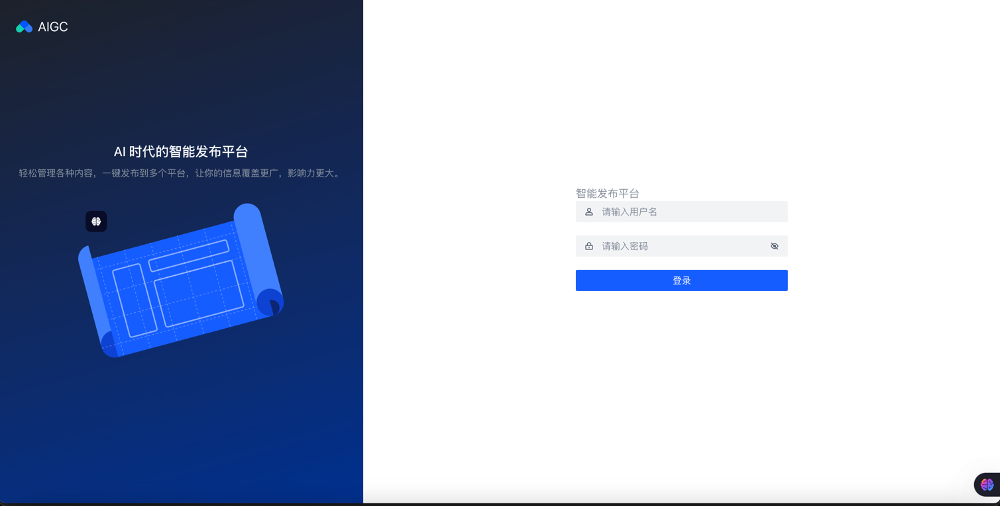
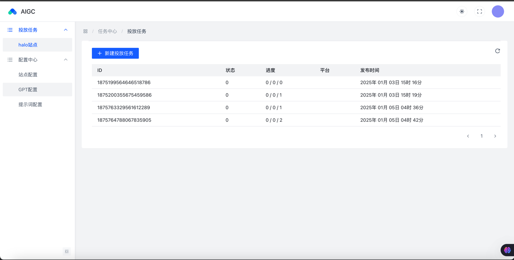

AIGC

## 项目描述
AI 时代的智能发布平台

轻松管理各种内容，一键发布到多个平台，让你的信息覆盖更广，影响力更大。

## 运行截图
登录页

首页

## 前端技术栈
- vue3
- typescript
- ui框架：arco-design
- 状态管理：pinia

## 后端技术栈
- java17
- mysql 5.7
- springboot 3.2.11
- mybatis-plus 3.5.8
- kafka
- clickhouse
